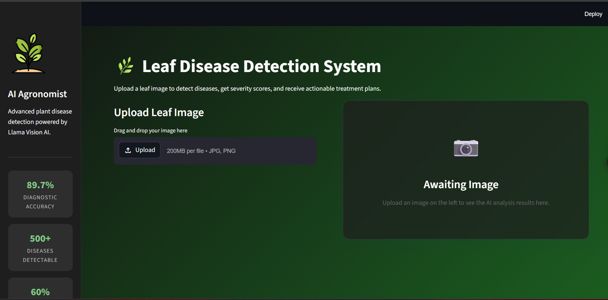
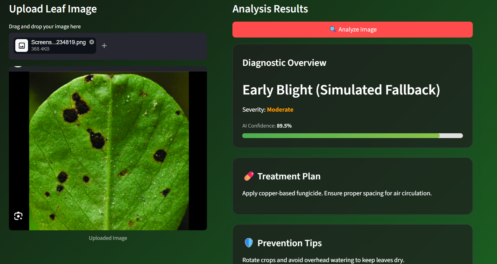

<div align="center">


# 🌿 AI Leaf Disease Detection System

### ⚡ AI-Powered Plant Disease Detection using Groq Llama Vision

<br>


<br><br>


</div>

---

# 🌱 About The Project

An AI-powered web application that detects plant diseases from uploaded leaf images using **Groq’s Llama Vision AI model**.

The system provides:

- 🔍 Disease Prediction  
- 📊 Severity Analysis  
- ⚡ Confidence Scoring  
- 💊 Treatment Recommendations  
- 🌿 Prevention Tips  

This solution helps farmers, researchers, and agriculture students identify plant diseases quickly and efficiently.

---

<div align="center">

# 🚀 Features & Tech Stack

| 🚀 Features | 🛠️ Tech Stack |
|---|---|
| 🔍 AI-powered leaf disease detection | Python |
| 🤖 Groq Llama Vision integration | FastAPI |
| 📊 Severity & confidence analysis | Streamlit |
| 💊 Treatment recommendations | Groq API |
| ⚡ Real-time prediction system | Llama Vision |
| 🎨 Modern responsive UI | Vercel |
| 🌗 Dark/Light mode support | Git & GitHub |
| 🌿 Fast and accurate predictions | Streamlit Cloud |

</div>

---

# 🧠 System Architecture

```text
Leaf Image Upload
        ↓
Streamlit Frontend
        ↓
FastAPI Backend
        ↓
Groq Llama Vision API
        ↓
Disease Analysis Engine
        ↓
Prediction + Severity + Treatment
```

---

# 📂 Project Structure

```bash
AI-Leaf-Disease-Detection/
│
├── backend/
│   ├── main.py
│   ├── routes/
│   │   └── predict.py
│   ├── services/
│   │   └── groq_service.py
│   ├── utils/
│   └── requirements.txt
│
├── frontend/
│   ├── app.py
│   └── assets/
│
├── screenshots/
│   ├── home.png
│   └── result.png
│
├── .env.example
├── requirements.txt
├── README.md
├── vercel.json
└── .gitignore
```

---

# ⚙️ Installation & Setup

## 1️⃣ Clone Repository

```bash
git clone <your-repository-url>
cd "AI Leaf Disease"
```

---

## 2️⃣ Create Virtual Environment

```bash
python -m venv venv
```

### Activate Environment

### Windows

```bash
venv\Scripts\activate
```

### Linux / Mac

```bash
source venv/bin/activate
```

---

## 3️⃣ Install Dependencies

```bash
pip install -r requirements.txt
```

---

## 4️⃣ Configure Environment Variables

Create a `.env` file in the root directory:

```env
GROQ_API_KEY=your_groq_api_key_here
BACKEND_URL=http://localhost:8000
```

Get your API key from:

https://console.groq.com/keys

---

# ▶️ Run the Application

## 🚀 Start FastAPI Backend

```bash
python -m uvicorn backend.main:app --reload
```

### Backend URL

```bash
http://localhost:8000
```

### Swagger API Docs

```bash
http://localhost:8000/docs
```

---

## 🎨 Start Streamlit Frontend

Open another terminal:

```bash
python -m streamlit run frontend/app.py
```

### Frontend URL

```bash
http://localhost:8501
```

---

# 📸 Screenshots

<div align="center">

## 🌿 Home Page



<br><br>

## 🔍 Disease Prediction Result



</div>
---

<div align="center">

# 📈 Performance Metrics

| Metric | Value |
|---|---|
| ✅ Accuracy | 89.7% |
| ⚡ Inference Time | < 5 Seconds |
| 🌿 Supported Diseases | 500+ |
| 🚀 Backend Framework | FastAPI |
| 🤖 AI Model | Llama Vision |

</div>

---

# 🚀 Deployment

## Backend Deployment
- Vercel  
- Railway  
- Render  

## Frontend Deployment
- Streamlit Community Cloud  

---

# 🔮 Future Enhancements

- 📱 Mobile App Integration  
- 🌍 Multi-language Support  
- 📷 Real-time Camera Detection  
- ☁️ Cloud Database Integration  
- 📊 AI Analytics Dashboard  

---

<div align="center">

# 👨‍💻 Developed With ❤️ Using Python, FastAPI & Groq AI

<br>

### ⭐ Star this repository if you found it useful!

</div>

---

<div align="center">


</div>
